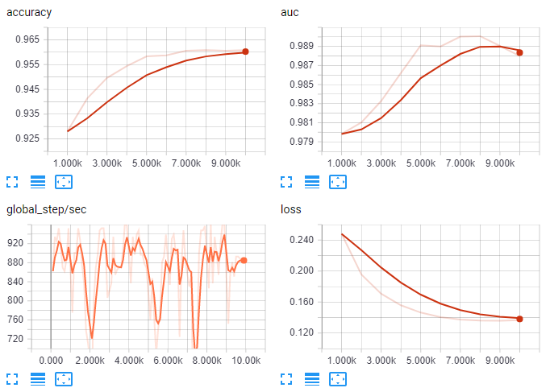

IceFlow
=======

_ice floe, nowhere to go_

A lightweight meta-framework for training neural networks with [TensorFlow](https://www.tensorflow.org/).

Installation
------------

    pip install iceflow

### Dependencies

 - `tensorflow>=1.3.0`
 - `dm-sonnet>=1.11`

Quick start
-----------

1. Define [Sonnet modules](https://deepmind.github.io/sonnet/) in `models.py`:

       import tensorflow as tf
       import sonnet as snt
       
       
       class MLP(snt.AbstractModule):
           def __init__(self, hidden_size, output_size, nonlinearity=tf.tanh):
               super(MLP, self).__init__()
               self._hidden_size = hidden_size
               self._output_size = output_size
               self._nonlinearity = nonlinearity
       
           def _build(self, inputs):
               lin_x_to_h = snt.Linear(output_size=self._hidden_size, name="x_to_h")
               lin_h_to_o = snt.Linear(output_size=self._output_size, name="h_to_o")
               return lin_h_to_o(self._nonlinearity(lin_x_to_h(inputs)))

2. Define [Datasets](https://www.tensorflow.org/programmers_guide/datasets)
   in `datasets.py`:

       from tensorflow.contrib.data import Dataset
       from tensorflow.examples.tutorials.mnist import input_data
       
       
       def mnist():
           # load mnist data
           mnist = input_data.read_data_sets('MNIST_data', one_hot=True)
       
           # make Datasets
           train_dataset = Dataset.from_tensor_slices(
               (mnist.train._images, mnist.train._labels))
           test_dataset = Dataset.from_tensor_slices(
               (mnist.test._images, mnist.test._labels))
       
           return train_dataset, test_dataset

3. Describe what you want to do in `test.cfg`:

       [DEFAULT]
       model_dir=test1
       model=MLP
       onehot=classes.txt
       loss=softmax_cross_entropy
       metrics=accuracy,auc
       hidden_size=50
       output_size=10

4. Train your model, evaluating every 1000 steps:

       $ iceflow train test.cfg mnist --eval_period 1000

5. Evaluate your model:

       $ iceflow eval test.cfg mnist
       {'auc': 0.98798531, 'loss': 0.13652229, 'accuracy': 0.96079999, 'global_step': 10000}

6. Visualize your learning in TensorBoard:

       $ tensorboard --logdir=test1

   Navigate to <http://localhost:6006> to see the metrics:

   

7. Add some new data to `datasets.py`

       import numpy as np

       def random_image():
           return None, Dataset.from_tensors(
               np.random.random((784,)).astype(np.float32))
       
       
       def random_images():
           return None, Dataset.from_tensor_slices(
               np.random.random((32, 784,)).astype(np.float32))

   and make predictions on it
   
       $ iceflow predict test.cfg random_image
       [5]
       
       $ iceflow predict test.cfg random_images
       [5, 5, 5, 5, 3, 5, 5, 5, 5, 5, 3, 5, 5, 5, 5, 5, 3, 5, 5, 5, 5, 5, 3, 3, 5, 5, 5, 5, 5, 5, 3, 5]

Config format reference
-----------------------

The format of the IceFlow config file is described in the [basic MLP example](examples/mlp).

API spec
--------

The `iceflow` API currently exposes two functions:

### `iceflow.make_estimator(configfile, section='DEFAULT', subgraph=None)`

This function uses a configfile as described above to allow quick, reproducible,
and tweakable instantiation of a `tf.Estimator` instance according to the
configfile.

#### Parameters

 - `configfile`: the filename where the configfile may be found on the disk
 - `section`: which section of the configfile to read from
 - `subgraph`: a string reference to a bound method on the model specifying a
   subgraph that inference should be performed in, or `None` if we want to use
   the normal/full graph

#### Returns

The instantiated `tf.Estimator`.

### `iceflow.make_input_fn(dataset, num_epochs=1, batch_size=32, shuffle=False, take=None)`

This function bridges the [Dataset API](https://www.tensorflow.org/programmers_guide/datasets)
and the `input_fn()` necessary for performing any operation with a
`tf.Estimator`.

A vanilla Dataset instance merely stores some examples, but an `input_fn()`
indicates how those examples will be accessed (at random, or not?; in batches of
how many?; etc.) during training, evaluation, inference, etc.

#### Parameters

 - `dataset`: a `tf.contrib.data.Dataset` instance to get data from
 - `num_epochs`: how many epochs to repeat for, or `None` to repeat forever
 - `batch_size`: size of each minibatch
 - `shuffle`: `False` to skip shuffling, otherwise an int specifying the size of
   the buffer to use for shuffling
 - `take`: an int specifying the number of examples to take from the Dataset, or
   `None` if we want to take all of them

#### Returns

An `input_fn()` suitable for use with a `tf.Estimator`.

Design philosophy
-----------------

Our typical workload involves training lots of models (usually with complex or
experimental architecture) with different sets of hyperparameters on different
datasets.

Previously, we had been using a hand-built meta-framework around TensorFlow to
organize training, evaluation, and inference.

As of TensorFlow 1.3, the [Dataset API](https://www.tensorflow.org/programmers_guide/datasets),
[Estimator API](https://www.tensorflow.org/programmers_guide/estimators), and
[DeepMind's Sonnet library](https://deepmind.github.io/sonnet/) have arisen as
mature alternatives to our hand-crafted solutions.

IceFlow aims to provide the small bit of code needed to get these three APIs to
work together seamlessly - without sacrificing flexibility - and provide an
efficient "command line and config file"-based interface to the basic train, 
eval, predict cycle.

Caveats and future directions
-----------------------------

 - Currently, the only possible output you can obtain from `iceflow predict` is
   tensors being printed to the command line. We plan to extend this to allow
   specification of an arbitrary Python function that takes the prediction
   results (arrays) as input.
 - Currently, performing validation every so often during training is very
   awkward. We are awaiting the return of [ValidationMonitor](https://www.tensorflow.org/get_started/monitors#configuring_a_validationmonitor_for_streaming_evaluation)
   from its banishment in the desert of deprecation (and following
   [this GitHub issue](https://github.com/tensorflow/tensorflow/issues/7669)).
