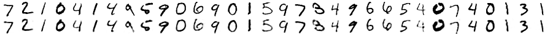

Autoencoders
============

Autoencoders are a bit more sophisticated than your average Estimator, which we
think of as just predicting an output `y` from an input `x`. Namely, they learn
a representation of the input data in a latent space, we'll call it `z`.

Model
-----

Taking a look at `models.py`, we see that we have written our Sonnet module to
have the following critical characteristics:

    class AE(snt.AbstractModule):
        ...
    
        @snt.reuse_variables
        def encode(self, inputs):
            """Builds the front half of AutoEncoder, x -> z."""
            if type(inputs) == dict:
                inputs = inputs['x']
            ...
    
        @snt.reuse_variables
        def decode(self, inputs):
            """Builds the back half of AutoEncoder, z -> y."""
            if type(inputs) == dict:
                inputs = inputs['z']
            ...
    
        def _build(self, inputs):
            """Builds the 'full' AutoEncoder, ie x -> z -> y."""
            latents = self.encode(inputs)
            return self.decode(latents)

The key take aways from this example are:

1. Subgraphs of the network are defined in functions called `encode()` and
   `decode()` which are decorated with `@snt.reuse_variables`.
2. These subgraph functions should allow passing a dict of inputs - the function
   should extract the key that it expects to compute on (either `x` or `z`).
3. The `_build()` function should construct the complete `x -> y` graph using
   the subgraph functions.

The result of this is that the network really has two different valid inputs to
three possible subgraphs, and IceFlow doesn't need to know anything about the
details of what these inputs are or what the signatures of the subgraphs are.

Dataset
-------

The Dataset is what ends up being responsible for matching the data expected by
the Model. If we look at `dataset.py` we see

    def mnist_ae():
        # load mnist data
        mnist = input_data.read_data_sets('MNIST_data', one_hot=True)
    
        # make Datasets
        train_dataset = Dataset.from_tensor_slices(
            ({'x': mnist.train._images}, mnist.train._images))
        test_dataset = Dataset.from_tensor_slices(
            ({'x': mnist.test._images}, mnist.test._images))
    
        return train_dataset, test_dataset
    
    
    def random_image_ae():
        image = np.random.random((784,)).astype(np.float32)
        return None, Dataset.from_tensors({'x': image})
    
    
    def random_embedding():
        embedding = np.random.random((10,)).astype(np.float32)
        return None, Dataset.from_tensors({'z': embedding})
    
    def random():
        image = np.random.random((784,)).astype(np.float32)
        embedding = np.random.random((10,)).astype(np.float32)
        return None, Dataset.from_tensors({'x': image, 'z': embedding})

The key take aways from this example are:

1. The Datasets still return a (train, test) tuple of (inputs, outputs), but now
   the inputs are a dict with keys that match the keys being listened for in the
   Model.
2. You can return any combination of input keys you like.

The result of this is that one Dataset function format can be used for all the
subgraphs we may want to run.

Specifying the subgraph
-----------------------

Running any of

    $ iceflow train ...
    $ iceflow eval ...
    $ iceflow test ...

runs the full `x -> y` graph, and requires the `x` key to be returned by the
Dataset function.

Running

    $ iceflow encode ...

is like `iceflow predict` but on the `x -> z` subgraph.

Similarly, running

    $ iceflow decode ...

is like `iceflow predict` but on the `z -> y` subgraph.

Visualizing reconstructions
---------------------------

For an example of how to visualize the trained autoencoder's reconstructions of
the first minibatch from the test set, check out `plot_reconstructions.py`,
which draws the following output image:

`plot_reconstructions.py` showcases three important ideas:

1. It creates an Estimator instance using the `iceflow` API with the call

       e = iceflow.make_estimator('test.cfg')

2. It uses the `iceflow` API to obtain an `input_fn()` describing the data we
   want to process:

       input_fn = iceflow.make_input_fn(test, take=32)

   In this situation, we are simply requesting the first 32 examples in the
   `test` Dataset, without shuffling, and without repetition.

   This `input_fn()` is suitable for use with the Estimator constructed above,
   but it can also be used to obtain a concrete `numpy` array of the inputs:

       with tf.Session() as sess:
           inputs, _ = sess.run(input_fn())

   Another way to get a concrete `numpy` array from the Dataset is to use the
   following idiom from the [Dataset API](https://www.tensorflow.org/programmers_guide/datasets):

       with tf.Session() as sess:
           inputs, _ = sess.run(test.batch(32).make_one_shot_iterator().get_next())

3. It performs inference in the graph of the original estimator:

       outputs = np.stack(list(e.predict(input_fn)))

   If we obtain data as concrete `numpy` arrays and we don't want to go through
   the hassle of constructing a Dataset to then create an `input_fn()`, we could
   instead do:

       outputs = np.stack(list(e.predict(
           tf.estimator.inputs.numpy_input_fn(inputs, shuffle=False))))
