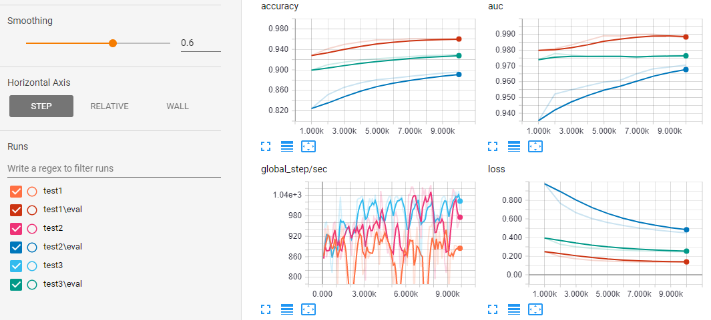

Iceflow basics: MLP
===================

In this example we illustrate the basic usage of IceFlow with a simple
multilayer perceptron model.

IceFlow is based around three core files, each of which specifies one important
aspect of a training/testing/inference workflow.

 1. `datasets.py` defines the data to be used for training/testing/inference
 2. `models.py` specifies the general model architecture
 3. a `.cfg` file specifies model and training hyperparameters

Dataset definition
------------------

Datasets should be defined as functions in a file called `datasets.py` which
return a (train, test) tuple of [Datasets](https://www.tensorflow.org/programmers_guide/datasets).

Each Dataset should itself be organized as a (features, targets) tuple.

Any of these tuples may be empty.

For example, here is a simple MNIST Dataset definition:

    from tensorflow.contrib.data import Dataset
    from tensorflow.examples.tutorials.mnist import input_data

    def mnist():
        # load mnist data
        mnist = input_data.read_data_sets('MNIST_data', one_hot=True)
    
        # make Datasets
        train_dataset = Dataset.from_tensor_slices(
            (mnist.train._images, mnist.train._labels))
        test_dataset = Dataset.from_tensor_slices(
            (mnist.test._images, mnist.test._labels))
    
        return train_dataset, test_dataset

Model definition
----------------

Models should be defined as classes in a file called `models.py`, ideally in the
form of [Sonnet modules](https://deepmind.github.io/sonnet/).

    import tensorflow as tf
    import sonnet as snt
    
    
    class MLP(snt.AbstractModule):
        def __init__(self, hidden_size, output_size, nonlinearity=tf.tanh):
            super(MLP, self).__init__()
            self._hidden_size = hidden_size
            self._output_size = output_size
            self._nonlinearity = nonlinearity
    
        def _build(self, inputs):
            lin_x_to_h = snt.Linear(output_size=self._hidden_size, name="x_to_h")
            lin_h_to_o = snt.Linear(output_size=self._output_size, name="h_to_o")
            return lin_h_to_o(self._nonlinearity(lin_x_to_h(inputs)))

Note that we expose the hyperparameters of the network (`hidden_size` and
`output_size`) in the constructor.

Hyperparameter specification
----------------------------

Hyperparameters for both the network and the training are defined in a
[configparser](https://docs.python.org/3/library/configparser.html)-style
configuration file.

The format of the IceFlow config file is roughly

    [DEFAULT]
    model_dir=test1
    model=MLP
    onehot=classes.txt
    loss=softmax_cross_entropy
    metrics=accuracy,auc
    hidden_size=50
    output_size=10
    
    [adagrad]
    model_dir=test2
    onehot=True
    optimizer=AdagradOptimizer
    learning_rate=0.001
    optimizer_kwargs={"initial_accumulator_value": 0.01}
    
    [expdecay]
    model_dir=test3
    onehot=True
    optimizer=AdagradOptimizer
    learning_rate=exponential_decay
    learning_rate_kwargs={
        "learning_rate": 0.1,
        "decay_steps": 1,
        "decay_rate": 0.9}

The `[DEFAULT]` section specifies a set of default parameters - the other
sections represent minor variations on the `[DEFAULT]` model.

`model_dir` should be a unique folder name to write checkpoints to.

`model` must refer to a Sonnet module defined in `models.py`.

`onehot` can be skipped or set to False if your labels are not one-hot encoded.
If your labels are one-hot encoded, set this to True (to report classification
results as the one-hot indices of the classes) or set it to the name of a text
file on the disk whose `i`th line is the name of the class encoded at index `i`
(to report classification results as strings).

`loss` must be one of the losses defined in the [`tf.losses module`](https://www.tensorflow.org/api_docs/python/tf/losses).

`optimizer` must be one of the subclasses of [`tf.train.Optimizer`](https://www.tensorflow.org/api_docs/python/tf/train/Optimizer)
defined in the [`tf.train` module](https://www.tensorflow.org/api_docs/python/tf/train).
If it is not passed it will default to [`tf.train.AdamOptimizer`](https://www.tensorflow.org/api_docs/python/tf/train/AdamOptimizer).

If `optimizer` requires a `learning_rate` parameter, you can either specify a
fixed learning rate (e.g., `learning_rate=0.001`) or one of the learning rate
decay schedulers in the [`tf.train` module](https://www.tensorflow.org/api_guides/python/train#Decaying_the_learning_rate)
(e.g., `learning_rate=exponential_decay`). These decay schedulers require extra
configuration, which should be specified in `learning_rate_kwargs`.

If you wish to pass additional kwargs to `optimizer`, you can do so in
`optimizer_kwargs`.

`metrics` can be skipped if you don't care about any evaluation metrics besides
the loss (which is always reported). If you do want to see additional metrics,
set this option to a comma-separated list of metrics defined in the
[`tf.metrics` module](https://www.tensorflow.org/api_docs/python/tf/metrics).

Every other key in the section is taken to be a hyperparameter which will be
passed as a kwarg to the constructor of the Sonnet module.

To train the model defined in the `[DEFAULT]` section, simply run

    $ iceflow train test.cfg mnist

The variant models, such as `[adagrad]`, inherit all hyperparameters from the
`[DEFAULT]` section but override some of them, including `model_dir` (to avoid
conflicting with the `[DEFAULT]` model). To train the `[adagrad]` variant, run

    $ iceflow train test.cfg mnist --config_section adagrad

Running the example
-------------------

Notice that in this example `test.cfg` file we are comparing three different
ways to train our MLP: Adam, Adagrad, and Adagrad with an exponential weight
decay. To train all three while recording test error over time, we can run:

    $ iceflow train test.cfg mnist --eval_period 1000
    $ iceflow train test.cfg mnist --config_section adagrad --eval_period 1000
    $ iceflow train test.cfg mnist --config_section expdecay --eval_period 1000

We can then run

    $ tensorboard logdir=.

and navigate to <http://localhost:6006> to compare the test error profiles:

The other difference between the three variants being tested illustrates the
behavior of the `onehot` configuration parameter.

In the `[DEFAULT]` section, we set `onehot=classes.txt`, where `classes.txt` is
a file which provides string names for the onehot label classes (one per line,
in order):

    zero
    one
    two
    three
    four
    five
    six
    seven
    eight
    nine

When we perform inference on this model, we get back the string name of the
inferred class:

    $ iceflow predict test.cfg random_image
    [b'five']

For the other sections, we set `onehot=True`, which causes the inferred classes
to be referred to by their onehot index:

    $ iceflow predict test.cfg random_image --config_section adagrad
    [5]
